<br />
<div align=center>
    <a id="back-to-top"></a>
    <div align="center">
        <a href="https://github.com/dippyshere/battle-breakers-private-server">
            
        </a>
    </div>
  <h4>A server reimplementation (private server) for <a href="https://en.wikipedia.org/wiki/Battle_Breakers">Battle Breakers</a></h4>
</div>

___

## About The Game

Battle Breakers was a cartoon-themed Hero collector, Turn-Based, and Action RPG game developed by Chair Entertainment
and Epic Games in 2014-2019. Released in beta in 2016 and launched in 2019, the game was since shut down at the end
of 2022.

## About This Project

This project is a **complete reimplementation** of every Epic Games backend service required to run and play the game
(AKA: Private Server, Server Emulator, Game Server, etc.). It is designed to be a complete standalone replacement for the original
game servers, in addition to all other services the game contacts, allowing the game to be played as it was when it was live.
It strives to be as complete and accurate as possible, to preserve the game and its legacy. It aims to be **fully
compatible** with all versions of the game, on all platforms, from the 2017 beta to the final release.

[This project](https://github.com/dippyshere/battle-breakers-private-server) would not have been possible
without [the data](https://github.com/dippyshere/battle-breakers-documentation) [I](https://github.com/dippyshere)
captured, the help and data provided by [Lele](https://github.com/LeleDerGrasshalmi/) and
his [Epic Games Documentation](https://github.com/LeleDerGrasshalmi/FortniteEndpointsDocumentation/), and the combined
game knowledge of the [Battle Breakers community](https://discord.gg/3Hpv72hvvx).

## Project Goals

- [x] **Fully Compatible**: The server should be able to support all versions of the game, from the 2017 beta to the
  final release.
- [ ] **Stable and Secure**: The server should be stable and secure.
- [ ] **Complete and Accurate**: The server should be as complete and accurate as possible, implementing all features
  and services used by the game.

## Features

<details open>

<summary>Services</summary>

These are the services that the game clients use, and their current implementation status on the server.

| Service                 | Description                                                                          | Status | Notes                                                                                                  |
|-------------------------|--------------------------------------------------------------------------------------|:------:|--------------------------------------------------------------------------------------------------------|
| Account Service         | Handles account creation, login, and management                                      |   ✅    |                                                                                                        |
| Affiliate Service       | Handles looking up Support-A-Creator codes                                           |   ✅    |                                                                                                        |
| Battle Breakers CDN     | Serves cooked game PAKs and manifests                                                |   ✅    |                                                                                                        |
| Catalog Service         | Handles looking up data about the game's catalog, including IAPs and other offers    |   ✅    |                                                                                                        |
| Data router Service     | Collects and sends analytics data, specifically technical performance and engagement |   ✅    | Breakers revived does not process or collect any of this data                                          |
| Entitlement Service     | Manages entitlements and rewards                                                     |   ✅    |                                                                                                        |
| EULA Tracking Service   | Tracks EULA acceptance                                                               |   ✅    |                                                                                                        |
| Friends Service         | Manages friends and friend requests                                                  |   ✅    |                                                                                                        |
| Lightswitch Service     | Manages server downtime status                                                       |   ✅    |                                                                                                        |
| Presence Service        | Manages player presence and status                                                   |   ✅    |                                                                                                        |
| Price Engine Service    | Manages prices and currency conversion                                               |   ⏳    | Currently the implementation only supports AUD                                                         |
| World Explorers Service | Manages everything else related to the game and gameplay                             |   ⏳    | While most operations are currently implemented, not all implemented operations are currently complete |

</details>

<details open>

<summary>World Explorers Service</summary>

These are services that were under the World Explorers Service, and their current implementation status on the server.

| Service           | Description                                                                                     | Status | Notes                                                                                                                                                                            |
|-------------------|-------------------------------------------------------------------------------------------------|:------:|----------------------------------------------------------------------------------------------------------------------------------------------------------------------------------|
| Calendar Timeline | Manages the game's calendar, including events, battle passes, and other time-based content      |   ⏳    | Battle pass rotation is complete, other rotational content is frozen at the last week of December, 2022                                                                          |
| Catalog           | Manages the game's catalog, including IAPs, offers, and other storefronts                       |   ⏳    | Content not yet rotational, currently frozen at the last week of December, 2022                                                                                                  |
| Cloud Storage     | Manages cloud storage for the game, including config file hotfixes                              |   ✅    | Older clients did not support hot-fixing, so some config patches need to be applied for full functionality externally to the server                                              |
| Entitlements      | Manages entitlements and ban handling                                                           |   ✅    |                                                                                                                                                                                  |
| Friends           | Manages searching for legacy friends for the older friends implementation prior to Epic Friends |   ✅    | Friend gifts are not functional due to captured data being lost. Please get in touch if you may have the relevant data OR can assist with SDK dumping a **32-bit** UE 4.25 title |
| Item Rating       | Manages user-voted ratings on heroes and pets based on their gameplay and visual appearance     |   ✅    | The user submitted ratings were archived for many, but not all heroes and pets                                                                                                   |
| Manifests         | Serves ChunkV3 master manifests for 1.0-1.5 game clients                                        |   ✅    |                                                                                                                                                                                  |
| Receipts          | Manages receipts for purchases                                                                  |   ✅    |                                                                                                                                                                                  |
| Version Checks    | Manages version checks for the game                                                             |   ✅    | The server supports all client versions, so no versions are enforced                                                                                                             |
| MCP               | Manages all in-game actions, including profile save data, levels, rewards, etc.                 |   ⏳    | While most operations are currently implemented, not all implemented operations are currently complete. See below for more details                                               |

</details>

<details>

<summary>MCP Service</summary>

These are the various MCP operations that the game clients use, and their current implementation status on the server.

| Operation                       | Description                                                                                                                     | Status | Notes                                                                                                                                                                                                        |
|---------------------------------|---------------------------------------------------------------------------------------------------------------------------------|:------:|--------------------------------------------------------------------------------------------------------------------------------------------------------------------------------------------------------------|
| AbandonLevel                    | Abandons a level                                                                                                                |   ⏳    |                                                                                                                                                                                                              |
| AddEpicFriend                   | Adds an Epic friend                                                                                                             |   ✅    |                                                                                                                                                                                                              |
| AddFriend                       | Adds a legacy WEX friend                                                                                                        |   ✅    |                                                                                                                                                                                                              |
| AddToMonsterPit                 | Adds a hero to the monster pit                                                                                                  |   ✅    |                                                                                                                                                                                                              |
| BlitzLevel                      | Blitzes a level, completing it without entering the level                                                                       |   ✅    |                                                                                                                                                                                                              |
| BulkImproveHeroes               | Improves multiple heroes at once                                                                                                |   ✅    | The logic used for the upgrade algorithm differs slightly between the client and the server, meaning the client will offer upgrades multiple times until all usable resources have been expended             |
| BuyBackFromMonsterPit           | Buys back a hero from the monster pit                                                                                           |   ✅    |                                                                                                                                                                                                              |
| CashOutWorkshop                 | Caches out collected stars -> gold at the workshop                                                                              |   ✅    |                                                                                                                                                                                                              |
| ClaimAccountReward              | Claims an account perk reward                                                                                                   |   ✅    |                                                                                                                                                                                                              |
| ClaimComeBackReward             | Claims the come back reward                                                                                                     |   ❌    | This was a legacy event that is no longer active                                                                                                                                                             |
| ClaimEventRewards               | Claims Battle pass rewards                                                                                                      |   ❌    |                                                                                                                                                                                                              |
| ClaimGiftPoints                 | Claims friend gift points                                                                                                       |   ❌    | Unfortunately the data required for this operation was lost. Please get in touch if you may have the relevant data OR can assist with SDK dumping a **32-bit** UE 4.25 title                                 |
| ClaimLoginReward                | Claims the daily login reward                                                                                                   |   ✅    |                                                                                                                                                                                                              |
| ClaimNotificationOptInReward    | Claims the notification opt-in reward                                                                                           |   ✅    |                                                                                                                                                                                                              |
| ClaimQuestReward                | Claims a quest reward                                                                                                           |   ✅    |                                                                                                                                                                                                              |
| ClaimTerritory                  | Claims a territory                                                                                                              |   ✅    |                                                                                                                                                                                                              |
| ClientTrackedRetentionAnalytics | Updates the tracked account level milestone                                                                                     |   ✅    |                                                                                                                                                                                                              |
| CollectHammerQuestEnergy        | Used by the early hammer quest system                                                                                           |   ❌    |                                                                                                                                                                                                              |
| CollectHammerQuestRealtime      | Used by the early hammer quest system                                                                                           |   ❌    |                                                                                                                                                                                                              |
| DeleteFriend                    | Unfriends a WEX friend, or cancels an invite                                                                                    |   ✅    |                                                                                                                                                                                                              |
| EvolveHero                      | Evolves a hero                                                                                                                  |   ✅    |                                                                                                                                                                                                              |
| FinalizeLevel                   | Submits and finalizes a level                                                                                                   |   ⏳    | This operation requires data about most levels completed by players on the original servers to be collected for accuracy                                                                                     |
| FoilHero                        | Foils a hero                                                                                                                    |   ✅    |                                                                                                                                                                                                              |
| GenerateDailyQuests             | Refreshes and generates daily quests, and reports friend gifts received                                                         |   ❌    | The friend gift component of this operation is not functional as the required data was lost. Please get in touch if you may have the relevant data OR can assist with SDK dumping a **32-bit** UE 4.25 title |
| GenerateMatchWithFriend         | Generates a spar match with a friend                                                                                            |   ⏳    |                                                                                                                                                                                                              |
| GenerateMatches                 | Used by the early asynchronous PvP system                                                                                       |   ❌    |                                                                                                                                                                                                              |
| InitalizeLevel                  | Initializes a level                                                                                                             |   ⏳    | This operation requires data about the kinds of enemies, loot, rooms and Battle pass XP present in each level and difficulty to be collected for accuracy                                                    |
| JoinMatchmaking                 | Used by the current asynchronous PvP system. Refreshes and generates upcoming PvP matches                                       |   ❌    |                                                                                                                                                                                                              |
| LevelUpHero                     | Levels up a hero                                                                                                                |   ✅    |                                                                                                                                                                                                              |
| MarkHeroSeen                    | Marks a hero as seen                                                                                                            |   ✅    | This is a legacy operation that was replaced by MarkItemSeen in newer clients                                                                                                                                |
| MarkItemSeen                    | Marks an item as seen                                                                                                           |   ✅    |                                                                                                                                                                                                              |
| ModifyHeroArmor                 | Modifies a hero's armor                                                                                                         |   ✅    |                                                                                                                                                                                                              |
| ModifyHeroGear                  | Modifies a hero's gear                                                                                                          |   ✅    |                                                                                                                                                                                                              |
| ModifyHeroWeapon                | Modifies a hero's weapon                                                                                                        |   ✅    |                                                                                                                                                                                                              |
| OpenGiftBox                     | Opens a gift box                                                                                                                |   ✅    |                                                                                                                                                                                                              |
| OpenHeroChest                   | Opens a skybreaker pick                                                                                                         |   ⏳    | Data about the next heroes in the skybreaker sequences is yet to be implemented                                                                                                                              |
| PickHeroChest                   | Selects a skybreaker pick to open                                                                                               |   ✅    |                                                                                                                                                                                                              |
| PromoteHero                     | Promotes a hero                                                                                                                 |   ✅    |                                                                                                                                                                                                              |
| PurchaseCatalogEntry            | Purchases an item, or redeems an offer                                                                                          |   ❌    |                                                                                                                                                                                                              |
| QueryProfile                    | Returns the up-to-date version of the specified profile                                                                         |   ✅    |                                                                                                                                                                                                              |
| Reconcile                       | Refreshes the status of the player's friends, determining whether friends have upgraded from legacy WEX friends to Epic friends |   ✅    |                                                                                                                                                                                                              |
| RedeemToken                     | Redeems a token for an item                                                                                                     |   ✅    |                                                                                                                                                                                                              |
| RefreshRunCount                 | Refreshes the run count of event content in older clients                                                                       |   ❌    |                                                                                                                                                                                                              |
| RemoveFriend                    | Removes a friend, or cancels an invite                                                                                          |   ✅    |                                                                                                                                                                                                              |
| RemoveFromMonsterPit            | Removes a hero from the monster pit                                                                                             |   ✅    |                                                                                                                                                                                                              |
| RemoveHeroFromAllParties        | Removes a hero from all parties                                                                                                 |   ✅    |                                                                                                                                                                                                              |
| RollHammerChests                | Rolls for new hammer chests                                                                                                     |   ✅    |                                                                                                                                                                                                              |
| SelectHammerChest               | Selects a hammer chest to start opening                                                                                         |   ✅    |                                                                                                                                                                                                              |
| SelectStartOptions              | Selects a starter hero and sets a display name                                                                                  |   ✅    |                                                                                                                                                                                                              |
| SellGear                        | Sells gear                                                                                                                      |   ✅    |                                                                                                                                                                                                              |
| SellHero                        | Sells a hero                                                                                                                    |   ✅    |                                                                                                                                                                                                              |
| SellMultipleGear                | Sells multiple of one gear at a time                                                                                            |   ✅    |                                                                                                                                                                                                              |
| SellTreasure                    | Sells treasure                                                                                                                  |   ✅    |                                                                                                                                                                                                              |
| SendGiftPoints                  | Sends gift points to friends                                                                                                    |   ❌    | Unfortunately the data required for this operation was lost. Please get in touch if you may have the relevant data OR can assist with SDK dumping a **32-bit** UE 4.25 title                                 |
| SetAffiliate                    | Sets a Support-A-Creator affiliate                                                                                              |   ✅    |                                                                                                                                                                                                              |
| SetDefaultParty                 | Sets the active hero party to use                                                                                               |   ✅    |                                                                                                                                                                                                              |
| SetRepHero                      | Sets the player's rep hero(s) for friends to see and use                                                                        |   ✅    |                                                                                                                                                                                                              |
| SuggestFriends                  | Refreshes friend suggestions for the player to add                                                                              |   ✅    |                                                                                                                                                                                                              |
| SuggestionResponse              | Responds to a friend suggestion, accepting or rejecting the suggestion                                                          |   ✅    |                                                                                                                                                                                                              |
| TapHammerChest                  | Opens a hammer chest one time                                                                                                   |   ✅    |                                                                                                                                                                                                              |
| UnlockArmorGear                 | Unlocks armor gear on a hero                                                                                                    |   ✅    |                                                                                                                                                                                                              |
| UnlockHeroGear                  | Unlocks hero gear on a hero                                                                                                     |   ✅    |                                                                                                                                                                                                              |
| UnlockRegion                    | Unlocks a region                                                                                                                |   ✅    |                                                                                                                                                                                                              |
| UnlockWeaponGear                | Unlocks weapon gear on a hero                                                                                                   |   ✅    |                                                                                                                                                                                                              |
| UpdateAccountHeadlessStatus     | Updates the account headless status                                                                                             |   ✅    |                                                                                                                                                                                                              |
| UpdateFriends                   | Updates friends                                                                                                                 |   ✅    |                                                                                                                                                                                                              |
| UpdateMonsterPitPower           | Updates the monster pit power, leveling up if necessary                                                                         |   ✅    | The Monster Pit XP calculation algorithm differs very slightly between the server and the client, however this is only visual and does not have an impact on functionality nor security of the operation     |
| UpdateParty                     | Updates the hero party members                                                                                                  |   ✅    |                                                                                                                                                                                                              |
| UpgradeBuilding                 | Upgrades a building                                                                                                             |   ✅    |                                                                                                                                                                                                              |
| UpgradeHero                     | Upgrades a hero                                                                                                                 |   ✅    |                                                                                                                                                                                                              |
| UpgradeHeroSkills               | Upgrades a hero's skills                                                                                                        |   ✅    |                                                                                                                                                                                                              |
| VerifyRealMoneyPurchase         | Verifies a real money transaction, fulfilling purchased rewards                                                                 |   ✅    | It is not possible to make RMT purchases on the server, and so RMT offers will not be fulfilled at this time                                                                                                 |

Totals:
- ✅: 56 (77%)
- ⏳: 5 (7%)
- ❌: 11 (15%)
- Total: 72

</details>

## Self-Hosting the Server

### Prerequisites

- [Python 3.11+](https://www.python.org/downloads/)
- [MongoDB](https://www.mongodb.com/try/download/community)

### Installation

1. Clone the repository

    ```sh
    git clone --recurse-submodules https://github.com/dippyshere/battle-breakers-private-server.git
    cd battle-breakers-private-server
    ```

2. Install the required packages

    ```sh
    pip install --upgrade -r requirements.txt
    ```

3. Start the MongoDB server

   (Windows)
    ```cmd
    net start MongoDB
    ```

   (Linux)
    ```bash
    sudo systemctl start mongodb
    ```

   > [!NOTE]
   > Depending on your MongoDB installation you may need to use `mongod` instead of `mongodb`.
   
   (macOS)
    ```shell
    brew services start mongodb-community
    ```

4. Start the server

    ```sh
    sanic main:app
    ```
5. Configure the game to connect to your server

## Contributing

Any contributions you make are **greatly appreciated**. Please read the [CONTRIBUTING.md](.github/CONTRIBUTING.md) file for more
details.

## Contact

If you have any questions, suggestions, or would like to get back into a Battle Breakers community, please join the
[Discord server](https://discord.gg/3Hpv72hvvx)! You can also contact me directly via the Discord server
(dippy is not here).

## Licence

This project is licenced under the Breakers Revived License (BRL) - see the [LICENSE](LICENSE) file for details.

## Support & Community

If you need help with anything, or have any questions, suggestions / requests, or would like to get back into a Battle
Breakers community, please join the [Discord server](https://discord.gg/3Hpv72hvvx)!

___

###### <p align=center> Portions of the materials used are trademarks and/or copyrighted works of Epic Games, Inc. </p>

###### <p align=center> All rights reserved by Epic. </p>

###### <p align=center> This material is not official and is not endorsed by Epic. </p>

<div align="center">
<a href="https://discord.gg/3Hpv72hvvx"></a>


<br>
ü´°üî´
</div>
